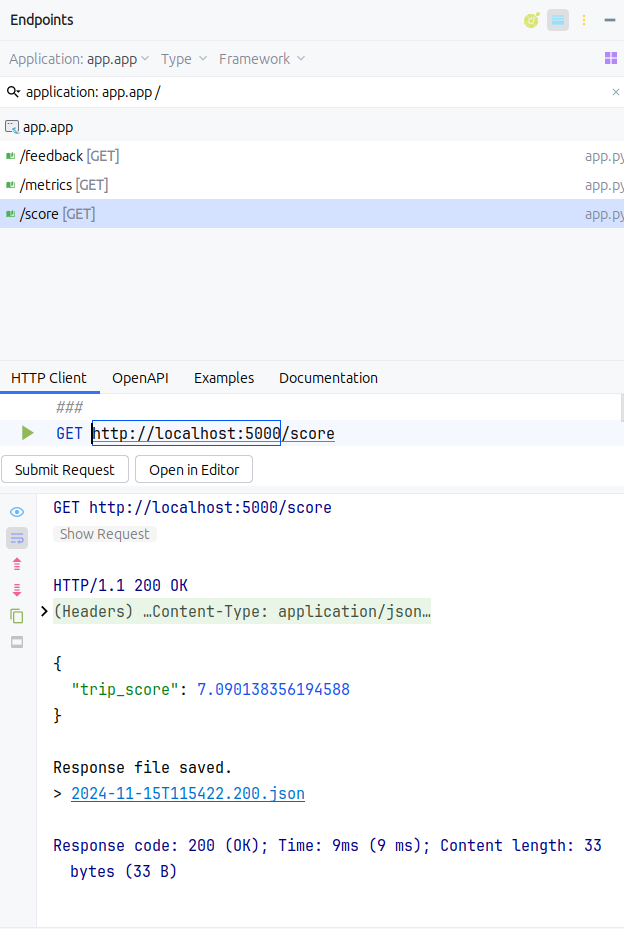

# Real-Time Eco-Driving Score & Feedback API

This Flask application provides real-time feedback on driving behavior and calculates an overall eco-driving score based on a pre-trained machine learning model. It includes several endpoints to retrieve the trip score, generate real-time driving warnings, and stream live driving metrics.

## Table of Contents
- [Overview](#overview)
- [Features](#features)
- [Tech Stack](#tech-stack)
- [Setup](#setup)
- [Usage](#usage)
- [Endpoints](#endpoints)
- [File Structure](#file-structure)
- [Explanation of Key Components](#explanation-of-key-components)
- [Future Enhancements](#future-enhancements)

---

## Overview
This backend is designed for a real-time eco-driving coach application. It processes driving data row-by-row, simulating a real-time environment by generating driving warnings and updating an eco-driving score. Data is pulled from a preloaded dataset in CSV format, which is processed using a trained machine learning model.

## Features
- **Calculate trip score**: Computes an overall score for the entire trip.
- **Generate real-time warnings**: Provides feedback based on various driving metrics (e.g., RPM, speed, engine load).
- **Stream live driving metrics**: Streams essential driving data row-by-row at a simulated real-time pace.

## Tech Stack
- **Backend**: Flask
- **Machine Learning**: Scikit-Learn
- **Data Handling**: Pandas
- **Communication**: Flask-CORS

## Setup
### Prerequisites
- Python 3.7+
- Flask
- Joblib
- Pandas
- Flask-CORS

### Installation
1. Clone the repository:
   ```bash
   git clone https://github.com/your-username/repo-name.git
   cd repo-name
   ```

2. Create a virtual environment:
   ```bash
   python3 -m venv .venv
   source .venv/bin/activate  # On Windows use .venv\Scripts\activate
   ```

3. Install dependencies:
   ```bash
   pip install -r requirements.txt
   ```

4. Ensure the following files are in place:
    - `data/driving_data.csv`: Contains the driving dataset.
    - `model/trained_model.pkl`: The pre-trained machine learning model.
    - `model/fitted_scaler.pkl`: The scaler used for preprocessing.

5. Run the app:
   ```bash
   python app.py
   ```

### Environment Variables
Set the environment variables for Flask:
   ```bash
   export FLASK_APP=app.py
   export FLASK_ENV=development
   ```

---

## Usage
Run the Flask application and use any REST client (e.g., Postman) or the frontend client to access the endpoints.

---

## Endpoints


| Endpoint     | Method | Description                                                                                       | Sample Response                                                                                                                                                                   |
|--------------|--------|---------------------------------------------------------------------------------------------------|-----------------------------------------------------------------------------------------------------------------------------------------------------------------------------------|
| `/score`     | `GET`  | Returns the overall eco-driving score for the entire trip.                                        | `{ "trip_score": 85.7 }` <br><br>                                                                                                     |
| `/feedback`  | `GET`  | Provides real-time feedback based on driving metrics, advancing 10 rows per request.              | `{ "warnings": ["High RPM: Reduce speed for better efficiency.", "Moderate Engine Load: Avoid aggressive driving."] }` <br><br> |
| `/metrics`   | `GET`  | Streams essential driving data one row at a time, simulating real-time data flow.                 | `{ "gps_speed": 75.0, "eLoad": 65.3, "rpm": 1800, "tPos": 45, "iat": 20, "kpl": 8.2 }` <br><br>                                   |


---

## File Structure
```
.
├── app.py                     # Main Flask app
├── data
│   └── driving_data.csv       # Driving dataset (input)
├── model
│   ├── trained_model.pkl      # Pre-trained model file
│   └── fitted_scaler.pkl      # Scaler for data preprocessing
├── model_handler.py           # Model handling and helper functions
├── requirements.txt           # Required dependencies
└── README.md                  # Project documentation
```

## Explanation of Key Components
1. **`app.py`**: Defines Flask routes to serve trip score, warnings, and real-time metrics.
2. **`model/model_handler.py`**: Contains helper functions to load the model, preprocess data, and generate warnings.
3. **Data Files**:
    - **`driving_data.csv`**: The dataset used for real-time feedback and metrics.
    - **`trained_model.pkl`**: Pre-trained ML model.
    - **`fitted_scaler.pkl`**: Scaler for data preprocessing.

---

## Future Enhancements
To improve the scalability and flexibility of the eco-driving system, a database can be integrated to store the driving metrics and calculated scores for each trip. This will allow for better tracking, historical analysis, and more advanced calculations over time.

### Key Features:
1. **Store Driving Metrics**: Each trip’s metrics (e.g., GPS speed, engine load, RPM, etc.) can be stored in a database for further analysis.
2. **Track Scores Over Time**: The calculated eco-driving scores for each trip can be stored and used to track performance over days, weeks, or months.
3. **Historical Data Analysis**: With data stored in a database, users can analyze their eco-driving behavior over time to find patterns or identify areas for improvement.

##### Example Flow:
- Store Trip Metrics: Each time a trip is completed, store the driving metrics and score in the database.
- Retrieve Data for Analysis: Users can retrieve their historical scores and metrics by specifying a time range (e.g., last 30 days).
- Calculate Aggregate Scores: Using the data stored in the database, calculate the overall eco-driving score over a specified period (e.g., weekly or monthly).
